-   [Overview](#overview)
-   [Setup](#setup)
-   [Query data](#query-data)
-   [Process and clean data](#process-and-clean-data)
-   [Basic statistics](#basic-statistics)
-   [Plot rate over time](#plot-rate-over-time)
-   [Plot likes versus retweets](#plot-likes-versus-retweets)
-   [Timeline of release date with
    likes](#timeline-of-release-date-with-likes)
-   [Timeline of release date with
    retweets](#timeline-of-release-date-with-retweets)
-   [Timeline of release data with ratio between favorite and retweet
    count](#timeline-of-release-data-with-ratio-between-favorite-and-retweet-count)
-   [Plot of rank tweet and likes](#plot-of-rank-tweet-and-likes)
-   [Plot of rank tweet and retweets](#plot-of-rank-tweet-and-retweets)
-   [What decade of movies are the most popular by
    likes?](#what-decade-of-movies-are-the-most-popular-by-likes)
-   [What decade of movies are the most popular by
    retweets?](#what-decade-of-movies-are-the-most-popular-by-retweets)
-   [Pixar movie popularity](#pixar-movie-popularity)
-   [Session information](#session-information)

Overview
========

Disney recently announced its new streaming service
[Disney+](https://twitter.com/disneyplus). On Twitter, their account
tweeted out a very long list of movies and TV series that they planned
on releasing.

<blockquote class="twitter-tweet">

It. Is. Time. From Snow White and the Seven Dwarfs to The Mandalorian,
check out basically everything coming to
<a href="https://twitter.com/hashtag/DisneyPlus?src=hash&amp;ref_src=twsrc%5Etfw">\#DisneyPlus</a>
in the U.S. on November 12.  Pre-order in the U.S. at
<a href="https://t.co/wJig4STf4P">https://t.co/wJig4STf4P</a> today:
<a href="https://t.co/tlWvp23gLF">https://t.co/tlWvp23gLF</a>
<a href="https://t.co/0q3PTuaDWT">pic.twitter.com/0q3PTuaDWT</a>

— Disney+ (@disneyplus)
<a href="https://twitter.com/disneyplus/status/1183715553057239040?ref_src=twsrc%5Etfw">October
14, 2019</a>
</blockquote>
My inner child was now curious as to which movies and TV series were
most popular, as "voted" by the twitterverse. And here we are.

**Last updated:** 2019-10-22

Setup
=====

    # Setup environment
    library(tidyverse)
    library(lubridate)
    library(ggrepel)
    library(ggthemes)
    library(rtweet)

Query data
==========

    # Get recent tweets
    # Note, this is the original tweet with a number of thread replies 2019-10-14
    # https://twitter.com/disneyplus/status/1183715553057239040
    rt <- get_timeline("disneyplus", n = 1000)
    saveRDS(rt, "disneyplus_search.rds")
    saveRDS(rt$status_id, "disneyplus_search-ids.rds")

But instead, here I'll just look up the status IDs.

    ids_file <- "disneyplus_search-ids.rds"
    disneyplus_file <- "disneyplus_search.rds"

    # Read in search directly if exists
    if (file.exists(disneyplus_file)) {
      rt <- readRDS(disneyplus_file)
    } else {
      # Download status IDs file
      download.file(
        "https://github.com/erictleung/disneyplus-twitter-analysis/blob/master/data/disneyplus_search-ids.rds?raw=true",
        ids_file
      )
      # Read status IDs from downloaded file
      ids <- readRDS(ids_file)

      # Lookup data associated with status ids
      rt <- rtweet::lookup_tweets(ids)
    }

Process and clean data
======================

Things to do:

-   Select number of likes and number of retweets
-   Focus on just the movies after the initial announcement
-   Extract the movie name and the year of the announcement

<!-- -->

    rt_clean <-
        rt %>%
        
        # Create subset of useful columns
        select(created_at,
               text,
               favorite_count,
               retweet_count) %>%

        # Focus on tweets after the annoucement
        filter(created_at > ymd_hms("2019-10-14 12:05:54")) %>%
        
        # Extract movie name
        mutate(movie_name = str_match(text, "\\b.* \\(")) %>%
        mutate(movie_name = str_remove(movie_name, " \\($")) %>%
        
        # Fix some odd characters
        mutate(movie_name = str_replace(movie_name, "&amp;", "&")) %>%

        # Extract movie year, being four numbers between parentheses
        mutate(movie_year = str_match(text, "\\([0-9]{4}\\)")) %>%
        mutate(movie_year = str_match(movie_year, "[0-9]{4}")) %>%
        
        # Identify decade of movie
        # Modified from: https://stackoverflow.com/a/48966643/
        mutate(movie_year = as.integer(movie_year)) %>%
        mutate(movie_decade = movie_year - movie_year %% 10) %>%
        mutate(movie_decade = as.factor(movie_decade)) %>%
        
        # Ratio betwen retweet counts and favorites
        mutate(ratio_like_to_rt = favorite_count / retweet_count) %>%

        # We can remove the original text, as we've extracted the useful info
        select(-text) %>%

        # Filter for rows that have movie name and year
        filter(!is.na(movie_year) | !is.na(movie_name)) %>%

        # Add row numbers for rank analyses
        arrange(created_at) %>%
        mutate(id = row_number()) %>%
        select(id, everything())

Basic statistics
================

    # Number of titles
    rt_clean %>% nrow()
    ## [1] 629

    # Titles per decade
    rt_clean %>% select(movie_decade) %>% table()
    ## .
    ## 1930 1940 1950 1960 1970 1980 1990 2000 2010 
    ##    1   12   22   23   31   35  109  207  189

Plot rate over time
===================

    rt_clean %>%
        ggplot(aes(x = created_at, y = id)) +
        geom_point() +
        geom_smooth(method = "loess", color = "grey", se = FALSE) +
        ggtitle(label = "Disney+ movies and series by tweet order and time",
                subtitle = "Fit by LOESS") +
        xlab("Time tweeted") +
        ylab("Tweet order") +
        labs(caption = "\nSource: Data gathered via Twitter's standard `search/tweets` API using rtweet") +
        theme_clean()

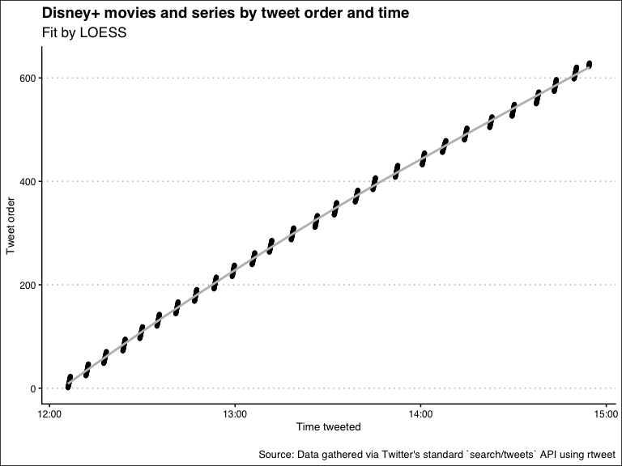

It appears that the Twitter account tweeted out in bursts and in regular
intervals.

Plot likes versus retweets
==========================

    rt_clean %>%
        ggplot(aes(x = favorite_count, y = retweet_count)) +
        geom_point(alpha = 0.6) +
        geom_vline(xintercept = 10000, color = "grey") +
        geom_smooth(method = "loess", color = "grey", se = FALSE) +
        geom_label_repel(data = subset(rt_clean, favorite_count > 10000), aes(label = movie_name)) +
        ggtitle(label = "Disney+ movies and series by\ntweet favorite and retweet counts",
                subtitle = "Labels shown for titles with >10k favorites and fit by LOESS") +
        xlab("Favorite count") +
        ylab("Retweet count") +
        labs(caption = "\nSource: Data gathered via Twitter's standard `search/tweets` API using rtweet") +
        theme_clean()

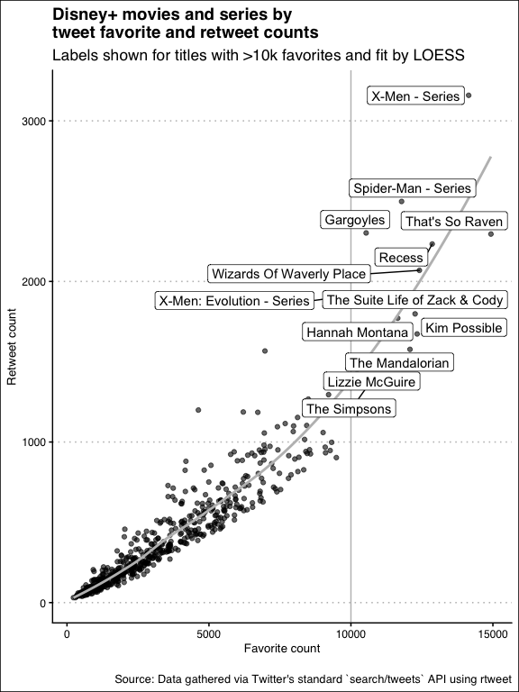

Let's facet this!

    rt_clean %>%
        ggplot(aes(x = favorite_count, y = retweet_count, color = movie_decade)) +
        geom_point(alpha = 0.6) +
        geom_smooth(method = "loess", color = "grey", se = FALSE) +
        facet_wrap(~ movie_decade) +
        ggtitle(label = "Disney+ movies and series by tweet favorite and retweet counts",
                subtitle = "Trends fit by LOESS and facetted by decade series/movie was released") +
        xlab("Favorite count") +
        ylab("Retweet count") +
        labs(caption = "\nSource: Data gathered via Twitter's standard `search/tweets` API using rtweet") +
        theme_clean() +
        theme(legend.position = "none")

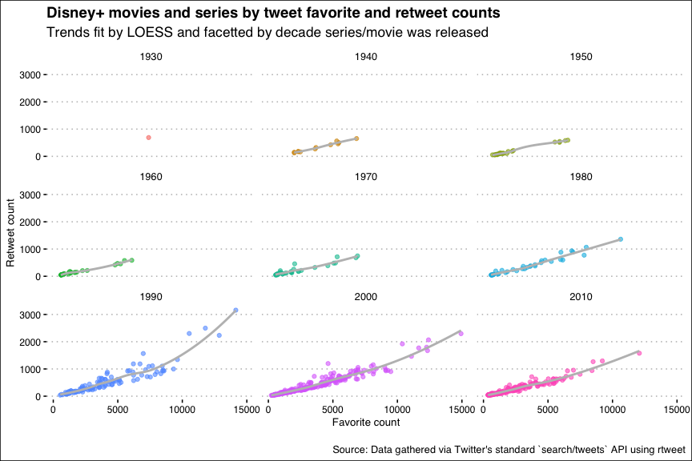

Timeline of release date with likes
===================================

    rt_clean %>%
        ggplot(aes(x = movie_year, y = favorite_count)) +
        geom_point(alpha = 0.6) +
        geom_label_repel(data = subset(rt_clean, favorite_count > 10000), aes(label = movie_name)) +
        ggtitle(label = "Disney+ movies and series by tweet favorite counts",
                subtitle = "Labels shown for titles with >10k favorites") +
        xlab("Movie or TV series release year") +
        ylab("Favorite count") +
        labs(caption = "\nSource: Data gathered via Twitter's standard `search/tweets` API using rtweet") +
        theme_clean()

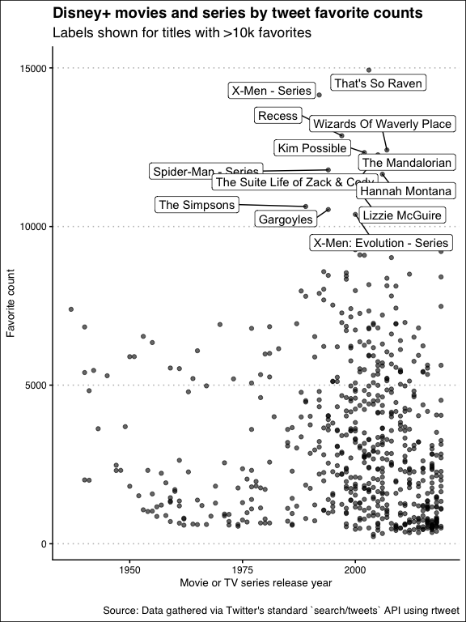

Timeline of release date with retweets
======================================

    rt_clean %>%
        ggplot(aes(x = movie_year, y = retweet_count)) +
        geom_point(alpha = 0.6) +
        geom_label_repel(data = subset(rt_clean, retweet_count > 1500), aes(label = movie_name)) +
        ggtitle(label = "Disney+ movies and series by tweet retweet counts",
                subtitle = "Labels shown for titles with >1.5k retweets") +
        xlab("Movie or TV series release year") +
        ylab("Retweet count") +
        labs(caption = "\nSource: Data gathered via Twitter's standard `search/tweets` API using rtweet") +
        theme_clean()

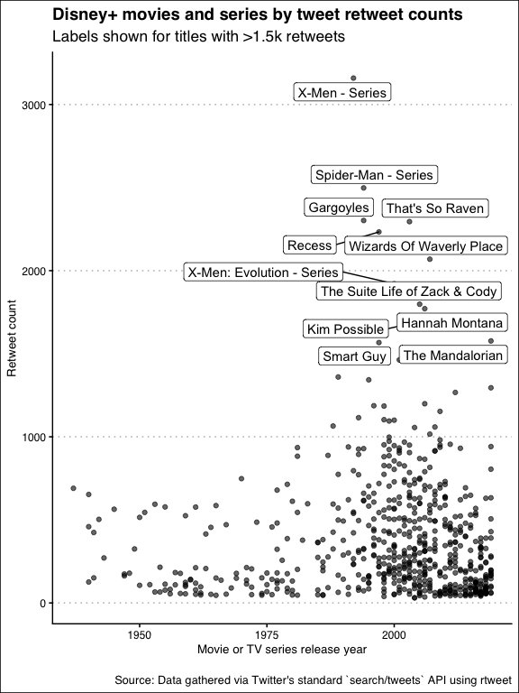

Timeline of release data with ratio between favorite and retweet count
======================================================================

    rt_clean %>%
        ggplot(aes(x = movie_year, y = ratio_like_to_rt, color = movie_decade)) +
        geom_boxplot() +
        geom_point(alpha = 0.3) +
        ggtitle(label = "Disney+ movies and series by ratio likeness",
                subtitle = "Ratio likeness is ratio of favorite count to retweet count") +
        xlab("Movie or TV series release year") +
        ylab("Ratio likeness") +
        labs(caption = "\nSource: Data gathered via Twitter's standard `search/tweets` API using rtweet") +
        theme_clean() +
        theme(legend.position = "none")

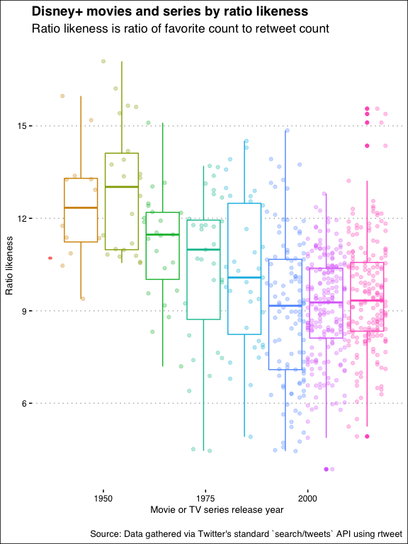

Plot of rank tweet and likes
============================

    rt_clean %>%
        ggplot(aes(x = id, y = favorite_count)) +
        geom_point(alpha = 0.6) +
        geom_label_repel(data = subset(rt_clean, favorite_count > 10000), aes(label = movie_name)) +
        ggtitle(label = "Disney+ movies and series by tweet order and favorites",
                subtitle = "Order sorted earliest to latest tweet time, labels with >10k likes") +
        xlab("Tweet order") +
        ylab("Favorite counts") +
        labs(caption = "\nSource: Data gathered via Twitter's standard `search/tweets` API using rtweet") +
        theme_clean()

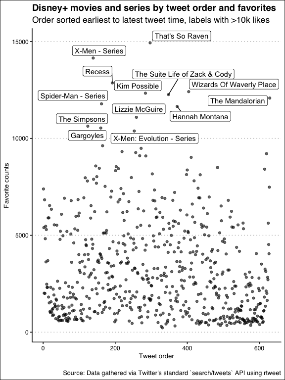

Plot of rank tweet and retweets
===============================

    rt_clean %>%
        ggplot(aes(x = id, y = retweet_count)) +
        geom_point(alpha = 0.6) +
        geom_label_repel(data = subset(rt_clean, retweet_count > 2000), aes(label = movie_name)) +
        ggtitle(label = "Disney+ movies and series by tweet order and retweets",
                subtitle = "Order sorted earliest to latest tweet time, labels with >5k retweets") +
        xlab("Tweet order") +
        ylab("Retweet counts") +
        labs(caption = "\nSource: Data gathered via Twitter's standard `search/tweets` API using rtweet") +
        theme_clean()

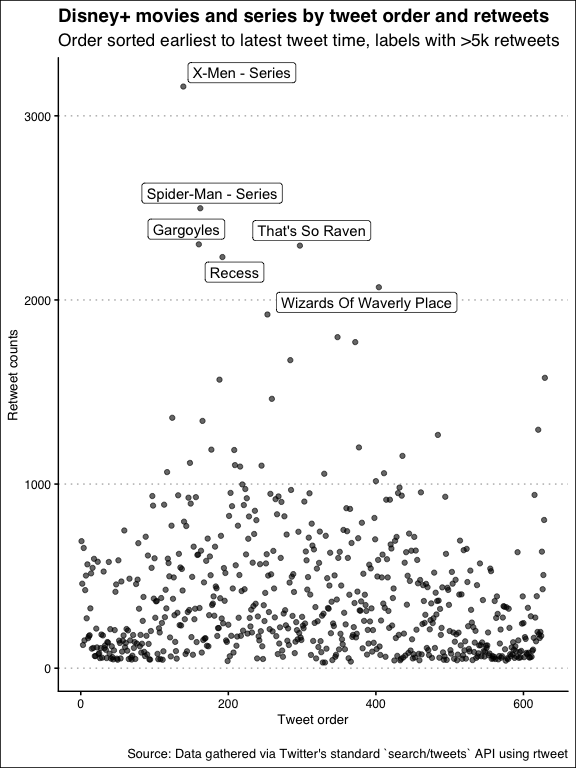

What decade of movies are the most popular by likes?
====================================================

    top_favorite_by_decade <-
        rt_clean %>%
        group_by(movie_decade) %>%
        arrange(favorite_count) %>%
        top_n(n = 1, wt = favorite_count) %>%
        ungroup()

    rt_clean %>%
        ggplot(aes(x = movie_year, y = favorite_count, color = movie_decade)) +
        geom_boxplot() +
        geom_point(alpha = 0.3) +
        geom_label_repel(data = top_favorite_by_decade, aes(label = movie_name)) +
        ggtitle(label = "Disney+ movies and series by decade and favorite count",
                subtitle = "Color represents decade, labeled titles are top favorite for each decade") +
        xlab("Movie or TV series release year") +
        ylab("Favorite count") +
        labs(caption = "\nSource: Data gathered via Twitter's standard `search/tweets` API using rtweet") +
        theme_clean() +
        theme(legend.position = "none")

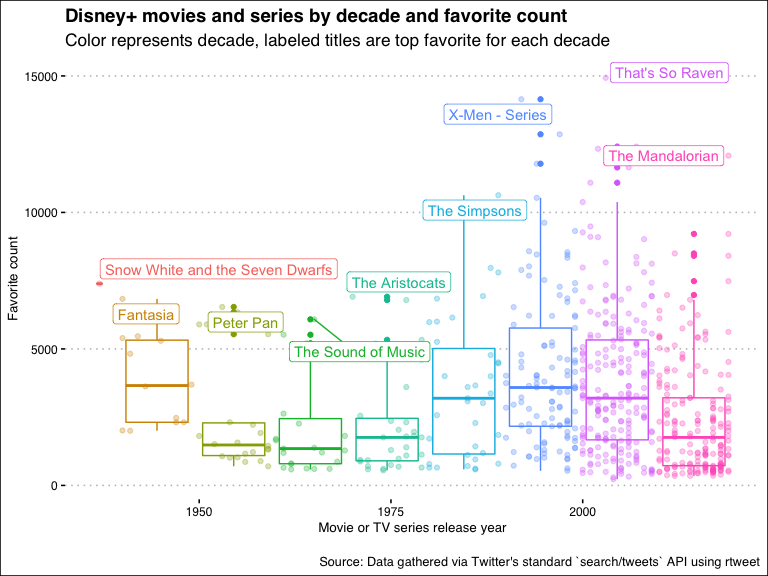

    bottom_favorite_by_decade <-
        rt_clean %>%
        group_by(movie_decade) %>%
        arrange(desc(favorite_count)) %>%
        top_n(n = -1, wt = favorite_count) %>%
        ungroup()

    rt_clean %>%
        ggplot(aes(x = movie_year, y = favorite_count, color = movie_decade)) +
        geom_boxplot() +
        geom_point(alpha = 0.3) +
        scale_y_log10() +
        geom_label_repel(data = bottom_favorite_by_decade, aes(label = movie_name)) +
        ggtitle(label = "Disney+ movies and series by decade and favorite count",
                subtitle = "Color represents decade, labeled titles are least favorite for each decade") +
        xlab("Movie or TV series release year") +
        ylab("Favorite count") +
        labs(caption = "\nSource: Data gathered via Twitter's standard `search/tweets` API using rtweet") +
        theme_clean() +
        theme(legend.position = "none")

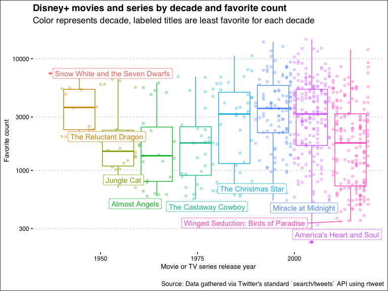

Both?

    favorites_by_decade <- dplyr::union(top_favorite_by_decade, bottom_favorite_by_decade)

    rt_clean %>%
        ggplot(aes(x = movie_year, y = favorite_count, color = movie_decade)) +
        geom_boxplot() +
        geom_point(alpha = 0.3) +
        coord_trans(y = "log10") +
        geom_label_repel(data = favorites_by_decade, aes(label = movie_name)) +
        ggtitle(label = "Disney+ movies and series by decade and favorite count",
                subtitle = "Color = decade, labeled titles are most and least favorite per decade, y-axis log10 scaled") +
        xlab("Movie or TV series release year") +
        ylab("Favorite count") +
        labs(caption = "\nSource: Data gathered via Twitter's standard `search/tweets` API using rtweet") +
        theme_clean() +
        theme(legend.position = "none")

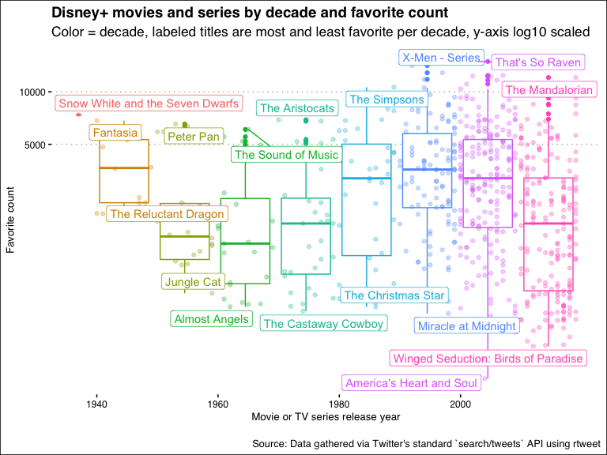

What decade of movies are the most popular by retweets?
=======================================================

    top_retweet_by_decade <-
        rt_clean %>%
        group_by(movie_decade) %>%
        arrange(retweet_count) %>%
        top_n(n = 1, wt = retweet_count) %>%
        ungroup()

    rt_clean %>%
        ggplot(aes(x = movie_year, y = retweet_count, color = movie_decade)) +
        geom_boxplot() +
        geom_point(alpha = 0.3) +
        geom_label_repel(data = top_retweet_by_decade, aes(label = movie_name)) +
        ggtitle(label = "Disney+ movies and series by decade and retweet count",
                subtitle = "Color represents decade, labeled titles are top retweet for each decade") +
        xlab("Movie or TV series release year") +
        ylab("Retweet count") +
        labs(caption = "\nSource: Data gathered via Twitter's standard `search/tweets` API using rtweet") +
        theme_clean() +
        theme(legend.position = "none")

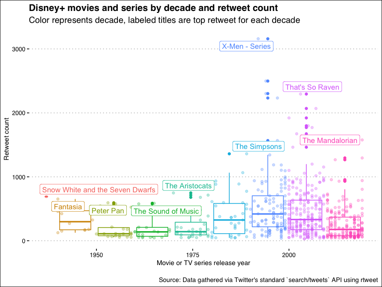

    bottom_retweet_by_decade <-
        rt_clean %>%
        group_by(movie_decade) %>%
        arrange(retweet_count) %>%
        top_n(n = -1, wt = retweet_count) %>%
        ungroup()

    rt_clean %>%
        ggplot(aes(x = movie_year, y = retweet_count, color = movie_decade)) +
        geom_boxplot() +
        geom_point(alpha = 0.3) +
        scale_y_log10() +
        geom_label_repel(data = bottom_retweet_by_decade, aes(label = movie_name)) +
        ggtitle(label = "Disney+ movies and series by decade and retweet count",
                subtitle = "Color represents decade, labeled titles are least retweeted for each decade") +
        xlab("Movie or TV series release year") +
        ylab("Retweet count") +
        labs(caption = "\nSource: Data gathered via Twitter's standard `search/tweets` API using rtweet") +
        theme_clean() +
        theme(legend.position = "none")

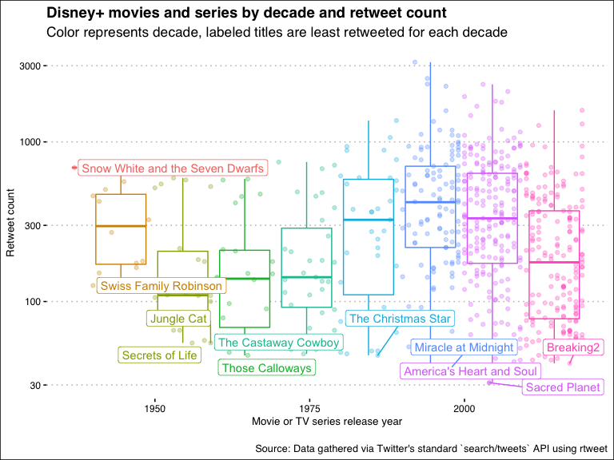

Both?

    retweets_by_decade <- dplyr::union(top_retweet_by_decade, bottom_retweet_by_decade)

    rt_clean %>%
        ggplot(aes(x = movie_year, y = retweet_count, color = movie_decade)) +
        geom_boxplot() +
        geom_point(alpha = 0.3) +
        coord_trans(y = "log10") +
        geom_label_repel(data = retweets_by_decade, aes(label = movie_name)) +
        ggtitle(label = "Disney+ movies and series by decade and retweet count",
                subtitle = "Color = decade, labeled titles are most and least retweet per decade, y-axis log10 scaled") +
        xlab("Movie or TV series release year") +
        ylab("Retweet count") +
        labs(caption = "\nSource: Data gathered via Twitter's standard `search/tweets` API using rtweet") +
        theme_clean() +
        theme(legend.position = "none")

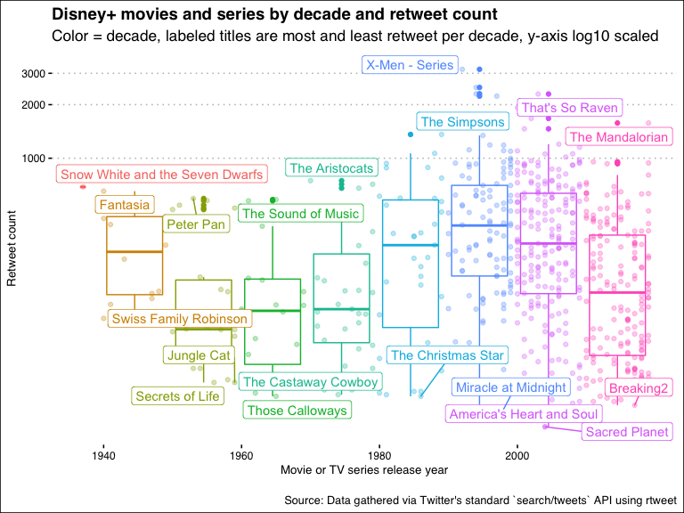

Pixar movie popularity
======================

    # Copied from https://en.wikipedia.org/wiki/List_of_Pixar_films
    pixar <- c(
        "Toy Story",
        "A Bug's Life",
        "Toy Story 2",
        "Monsters, Inc.",
        "Finding Nemo",
        "The Incredibles",
        "Cars",
        "Ratatouille",
        "WALL•E",
        "Up",
        "Toy Story 3",
        "Cars 2",
        "Brave",
        "Monsters University",
        "Inside Out",
        "The Good Dinosaur",
        "Finding Dory",
        "Cars 3",
        "Coco",
        "Incredibles 2",
        "Toy Story 4"
    )

    rt_clean %>%
        filter(movie_name %in% pixar) %>%
        ggplot(aes(x = favorite_count, y = retweet_count, color = movie_decade, label = movie_name)) +
        geom_point() +
        geom_smooth(method = "loess", color = "grey", se = FALSE) +
        geom_label_repel() +
        ggtitle(label = "Pixar movies announced to stream on Disney+\nby tweet favorite and retweet counts",
                subtitle = "Points labeled by movie decade, fit by LOESS") +
        xlab("Favorite count") +
        ylab("Retweet count") +
        labs(caption = "\nSource: Data gathered via Twitter's standard `search/tweets` API using rtweet") +
        theme_clean() +
        scale_color_discrete(name = "Decade") +
        theme(legend.position = "bottom")

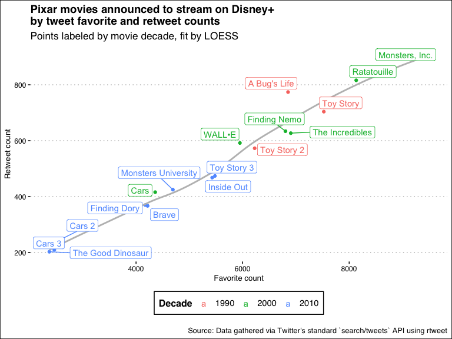

It appears the following movies weren't in the main list of
announcements:

-   Up
-   Coco
-   Incredibles 2
-   Toy Story 4

Session information
===================

    sessionInfo()
    ## R version 3.6.1 (2019-07-05)
    ## Platform: x86_64-apple-darwin15.6.0 (64-bit)
    ## Running under: OS X El Capitan 10.11.6
    ## 
    ## Matrix products: default
    ## BLAS:   /Library/Frameworks/R.framework/Versions/3.6/Resources/lib/libRblas.0.dylib
    ## LAPACK: /Library/Frameworks/R.framework/Versions/3.6/Resources/lib/libRlapack.dylib
    ## 
    ## locale:
    ## [1] en_US.UTF-8/en_US.UTF-8/en_US.UTF-8/C/en_US.UTF-8/en_US.UTF-8
    ## 
    ## attached base packages:
    ## [1] stats     graphics  grDevices utils     datasets  methods   base     
    ## 
    ## other attached packages:
    ##  [1] rtweet_0.6.9    ggthemes_4.2.0  ggrepel_0.8.1   lubridate_1.7.4
    ##  [5] forcats_0.4.0   stringr_1.4.0   dplyr_0.8.3     purrr_0.3.3    
    ##  [9] readr_1.3.1     tidyr_1.0.0     tibble_2.1.3    ggplot2_3.2.1  
    ## [13] tidyverse_1.2.1
    ## 
    ## loaded via a namespace (and not attached):
    ##  [1] tidyselect_0.2.5 xfun_0.10        haven_2.1.1      lattice_0.20-38 
    ##  [5] colorspace_1.4-1 vctrs_0.2.0      generics_0.0.2   htmltools_0.4.0 
    ##  [9] yaml_2.2.0       rlang_0.4.0      pillar_1.4.2     glue_1.3.1      
    ## [13] withr_2.1.2      modelr_0.1.5     readxl_1.3.1     lifecycle_0.1.0 
    ## [17] munsell_0.5.0    gtable_0.3.0     cellranger_1.1.0 rvest_0.3.4     
    ## [21] evaluate_0.14    labeling_0.3     knitr_1.25       broom_0.5.2     
    ## [25] Rcpp_1.0.2       scales_1.0.0     backports_1.1.5  jsonlite_1.6    
    ## [29] hms_0.5.1        digest_0.6.21    stringi_1.4.3    grid_3.6.1      
    ## [33] cli_1.1.0        tools_3.6.1      magrittr_1.5     lazyeval_0.2.2  
    ## [37] crayon_1.3.4     pkgconfig_2.0.3  zeallot_0.1.0    xml2_1.2.2      
    ## [41] assertthat_0.2.1 rmarkdown_1.16   httr_1.4.1       rstudioapi_0.10 
    ## [45] R6_2.4.0         nlme_3.1-141     compiler_3.6.1
